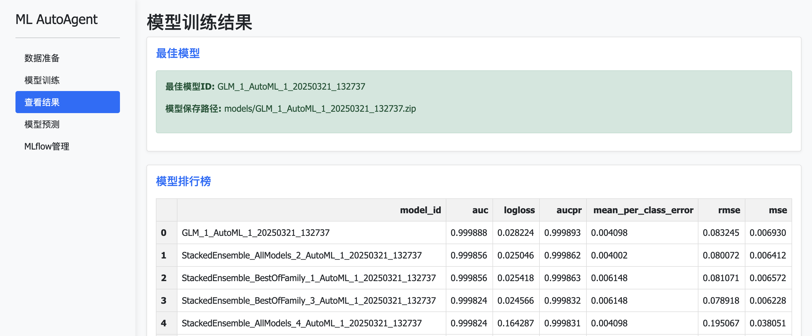

# ML-Agent: 基于大模型的智能机器学习自动化系统



## 项目简介

ML-Agent是一个革命性的机器学习自动化平台，它结合了大语言模型(LLM)的智能推理能力和H2O AutoML的高效建模能力，实现了从原始数据到高质量模型的端到端自动化流程。

核心流程: 原始数据 → 数据描述 → LLM推荐步骤 → H2O AutoML训练 → 多模型评估 → 最佳模型选择

这个系统适合各类用户：
- **数据科学初学者**：无需深厚的机器学习知识，也能构建高质量模型
- **经验丰富的数据科学家**：自动化繁琐任务，提高工作效率
- **业务分析师**：快速从数据中获取见解，无需编程技能

## ✨ 功能特点

- **智能工作流推荐**：利用大语言模型分析数据特征和用户需求，智能推荐合适的机器学习流程
- **自动代码生成与执行**：自动生成高质量Python代码并执行，无需手动编码
- **多模型训练与评估**：集成H2O AutoML，自动训练多种模型类型(GLM, RF, GBM, DNN等)
- **模型解释与可视化**：提供变量重要性分析、混淆矩阵等模型解释功能
- **Web界面操作**：用户友好的web界面，点击即可完成全流程
- **MLflow集成**：支持模型版本管理和部署(开发中)

## 🛠️ 技术架构

### 核心组件

1. **LLM推理引擎**：接入GPT-4o-mini模型，提供智能化建模建议
2. **H2O AutoML引擎**：自动训练和调优多种机器学习模型
3. **Web应用层**：基于Flask的用户交互界面
4. **持久化层**：训练状态和模型持久化存储

### 技术栈

- **后端**：Python, H2O, OpenAI API
- **前端**：HTML, CSS, JavaScript, Bootstrap
- **模型管理**：MLflow (部分功能)
- **数据处理**：Pandas, NumPy

## 🚀 快速开始

### 安装依赖

```bash
pip install -r requirements.txt
```

### 启动Web界面

```bash
python app.py
```
访问 http://localhost:8000 开始使用。

### Python API使用

```python
from ml_agent import H2OMLAgent
import pandas as pd

# 加载数据
data = pd.read_csv("your_data.csv")

# 创建H2O ML Agent
agent = H2OMLAgent(log=True, log_path="logs/", model_directory="models/")

# 调用Agent进行自动建模
agent.invoke_agent(
    data_raw=data,
    user_instructions="请执行分类任务，使用最大运行时间30秒。",
    target_variable="target_column_name"  # 替换为实际的目标变量列名
)

# 获取模型结果
print(agent.get_workflow_summary(markdown=True))
print(agent.get_leaderboard())
```

## 📊 模型支持

ML-Agent支持多种机器学习任务和模型类型：

- **分类问题**：二分类和多分类
- **回归问题**：数值预测
- **模型类型**：GLM, Random Forest, GBM, Deep Learning, Stacked Ensembles等
- **评估指标**：AUC, RMSE, MAE, Logloss, Precision, Recall等

## 🔧 配置与定制

### API配置

默认使用云服务API接口，你可以修改`yunwu.py`中的配置：

```python
client = OpenAI(
    base_url="你的API端点",
    api_key="你的API密钥"
)
```

### 高级选项

你可以通过以下参数定制AutoML的行为：

```python
agent.invoke_agent(
    data_raw=data,
    user_instructions="执行分类任务, 使用feature1-3作为特征",
    target_variable="target",
    max_runtime_secs=60,  # 最大运行时间
    max_models=10,        # 最大模型数量
    exclude_algos=["DeepLearning"]  # 排除特定算法
)
```

## 📁 项目结构

```
ml-agent/
├── app.py              # Flask Web应用
├── ml_agent.py         # 主要Agent实现
├── yunwu.py            # LLM API接口
├── run_h2o_agent.py    # 命令行运行脚本
├── predict_with_model.py # 预测脚本
├── example_data.csv    # 示例数据
├── static/             # 静态资源
│   ├── css/
│   ├── js/
│   └── img/
├── templates/          # HTML模板
├── logs/               # 日志目录
└── models/             # 模型保存目录
```

## 📖 系统流程


```
H2O机器学习Agent流程
|
|-- 1. 数据准备
|   |-- 加载数据集（example_data.csv）
|   |-- 数据预览和检查
|
|-- 2. 初始化ML Agent
|   |-- 创建H2OMLAgent实例
|   |-- 设置日志和模型保存路径
|   |-- 初始化H2O环境
|
|-- 3. 调用大模型（LLM）
|   |-- 准备数据描述和用户指令
|   |-- 发送请求到GPT-4o-mini
|   |-- 获取推荐的机器学习步骤
|
|-- 4. 生成AutoML代码
|   |-- 使用内置的H2O AutoML代码模板
|   |-- 将目标变量转换为分类变量
|   |-- 保存代码到日志目录
|
|-- 5. 执行自动机器学习
|   |-- 将数据转换为H2O Frame
|   |-- 设置AutoML参数（max_runtime_secs=30）
|   |-- 训练多个机器学习模型
|   |-- 选择最佳模型
|
|-- 6. 结果收集与报告
|   |-- 获取模型排行榜
|   |-- 保存最佳模型
|   |-- 记录模型路径和ID
|   |-- 生成工作流程摘要
|
|-- 7. 模型使用（predict_with_model.py）
    |-- 加载保存的最佳模型
    |-- 应用模型进行预测
    |-- 显示预测结果和模型性能
    |-- 分析变量重要性
```

1. **数据准备**：加载和预处理数据
2. **LLM分析**：大语言模型分析数据特征并推荐处理步骤
3. **代码生成**：基于LLM推荐自动生成H2O AutoML代码
4. **模型训练**：执行生成的代码，训练多种模型
5. **结果评估**：评估模型性能，选择最佳模型
6. **模型应用**：使用训练好的模型进行预测

## 📝 示例应用场景

- **客户流失预测**：预测哪些客户可能离开，并制定挽留策略
- **信用风险评估**：评估贷款申请人的信用风险
- **销售预测**：预测未来销售量，优化库存管理
- **医疗诊断**：辅助医疗疾病诊断和风险预测

## 🔜 未来规划

- 更丰富的预处理选项
- 特征工程的自动化
- 深度学习模型的支持增强
- 模型部署自动化
- 多模态数据支持

## 📄 许可证

Apache License 2.0

## 贡献者

- Leon @ 2024

---

> "将机器学习的复杂性隐藏在智能界面之后，让每个人都能构建高质量的预测模型。"

## 参考

https://github.com/business-science/ai-data-science-team/tree/master/examples/ml_agents

本项目参考了以下资源：
- H2O AutoML文档
- OpenAI API文档
- 机器学习自动化流水线最佳实践 
