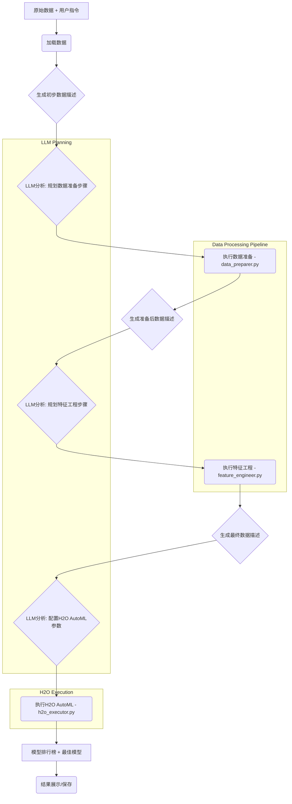

# ML-Agent: 基于大模型的智能机器学习自动化系统


## 项目简介

ML-Agent是一个革命性的机器学习自动化平台，它结合了大语言模型(LLM)的智能推理能力和H2O AutoML的高效建模能力，实现了从原始数据到高质量模型的端到端自动化流程。

核心流程: 原始数据 → 数据描述 → LLM推荐步骤 → H2O AutoML训练 → 多模型评估 → 最佳模型选择

这个系统适合各类用户：
- **数据科学初学者**：无需深厚的机器学习知识，也能构建高质量模型
- **经验丰富的数据科学家**：自动化繁琐任务，提高工作效率
- **业务分析师**：快速从数据中获取见解，无需编程技能

## ✨ 功能特点

- **智能工作流推荐**：利用大语言模型分析数据特征和用户需求，智能推荐合适的机器学习流程
- **自动代码生成与执行**：自动生成高质量Python代码并执行，无需手动编码
- **多模型训练与评估**：集成H2O AutoML，自动训练多种模型类型(GLM, RF, GBM, DNN等)
- **模型解释与可视化**：提供变量重要性分析、混淆矩阵等模型解释功能
- **Web界面操作**：用户友好的web界面，点击即可完成全流程
- **MLflow集成**：支持模型版本管理和部署(开发中)


ML-Agent项目是一个结合大语言模型(LLM)和H2O AutoML的智能机器学习自动化平台。

核心架构，项目采用模块化设计，包含三个主要阶段：

1. **数据代理阶段(Data Agent)**：
   - 分析原始数据并生成分析报告
   - LLM规划数据准备步骤
   - 执行数据清洗和基础转换
   - 评估处理后的数据质量

2. **特征工程阶段(Feature Engineering)**：
   - LLM分析已清洗数据并规划特征工程步骤
   - 执行特征转换、生成和选择
   - 评估特征质量

3. **模型代理阶段(Model Agent)**：
   - LLM配置H2O AutoML参数
   - 执行模型训练和评估
   - 选择最佳模型并生成报告

关键组件

- **LLM推理引擎**：提供智能建模建议和规划
- **数据准备模块**：处理数据清洗任务
- **特征工程模块**：执行特征创建任务
- **H2O AutoML引擎**：自动训练多种模型
- **主控Agent**：协调各模块工作
- **Web应用层**：提供用户界面

技术特点

- 智能工作流推荐
- 自动代码生成与执行
- 多模型训练与评估
- 模型解释与可视化
- 用户友好的Web界面


## 🛠️ 技术架构

### 核心组件

1. **LLM推理引擎**：接入GPT-4o-mini模型，提供智能化建模建议，**并规划数据准备和特征工程步骤**。
2. **数据准备模块 (`data_preparer.py`)**：包含执行常见数据清洗和预处理任务（如缺失值处理、编码、异常值检测）的函数。
3. **特征工程模块 (`feature_engineer.py`)**：包含执行特征创建任务（如交互特征、分箱、多项式特征）的函数。
4. **H2O AutoML引擎 (`h2o_executor.py`)**：自动训练和调优多种机器学习模型。
5. **主控Agent (`agent.py`)**：协调LLM规划、数据处理模块执行和H2O训练的核心逻辑。
6. **Web应用层**：基于Flask的用户交互界面 (`app.py`)。
7. **持久化层**：训练状态和模型持久化存储。

### 技术栈

- **后端**：Python, H2O, OpenAI API
- **前端**：HTML, CSS, JavaScript, Bootstrap
- **模型管理**：MLflow (部分功能)
- **数据处理**：Pandas, NumPy

## 🚀 快速开始

### 安装依赖

```bash
pip install -r requirements.txt
```

### 启动Web界面

```bash
python app.py
```
访问 http://localhost:8000 开始使用。

### Python API使用

```python
from ml_agent import H2OMLAgent
import pandas as pd

# 加载数据
data = pd.read_csv("your_data.csv")

# 创建H2O ML Agent
agent = H2OMLAgent(log=True, log_path="logs/", model_directory="models/")

# 调用Agent进行自动建模
agent.invoke_agent(
    data_raw=data,
    user_instructions="请执行分类任务，使用最大运行时间30秒。",
    target_variable="target_column_name"  # 替换为实际的目标变量列名
)

# 获取模型结果
print(agent.get_workflow_summary(markdown=True))
print(agent.get_leaderboard())
```

## 📊 模型支持

ML-Agent支持多种机器学习任务和模型类型：

- **分类问题**：二分类和多分类
- **回归问题**：数值预测
- **模型类型**：GLM, Random Forest, GBM, Deep Learning, Stacked Ensembles等
- **评估指标**：AUC, RMSE, MAE, Logloss, Precision, Recall等

## 🔧 配置与定制

### API配置

默认使用云服务API接口，你可以修改`yunwu.py`中的配置：

```python
client = OpenAI(
    base_url="你的API端点",
    api_key="你的API密钥"
)
```

### 高级选项

你可以通过以下参数定制AutoML的行为：

```python
agent.invoke_agent(
    data_raw=data,
    user_instructions="执行分类任务, 使用feature1-3作为特征",
    target_variable="target",
    max_runtime_secs=60,  # 最大运行时间
    max_models=10,        # 最大模型数量
    exclude_algos=["DeepLearning"]  # 排除特定算法
)
```

## 📁 项目结构

```
ml-agent/
├── app.py              # Flask Web应用
├── src/
│   └── ml_agent/
│       ├── __init__.py
│       ├── agent.py            # 主要Agent实现 (Orchestrator)
│       ├── llm_interface.py    # LLM API 接口封装
│       ├── data_preparer.py    # 数据准备/清洗工具函数 << NEW
│       ├── feature_engineer.py # 特征工程工具函数 << NEW
│       ├── h2o_executor.py     # H2O AutoML 执行器
│       └── utils.py            # 辅助工具函数
├── run_agent_cli.py    # 命令行运行脚本 (Updated/New)
├── predict_with_model.py # 预测脚本
├── example_data.csv    # 示例数据
├── static/             # 静态资源
│   ├── css/
│   ├── js/
│   └── img/
├── templates/          # HTML模板
├── logs/               # 日志目录
└── models/             # 模型保存目录
```

## 📖 系统流程



1.  **数据加载与分析**: 加载原始数据并生成初步描述。
2.  **LLM数据准备规划**: LLM根据数据描述和用户指令，生成结构化的数据清洗和准备步骤计划。
3.  **数据准备执行**: `agent.py`调用`data_preparer.py`中的函数执行LLM规划的步骤。
4.  **LLM特征工程规划**: LLM分析准备好的数据，规划特征工程步骤。
5.  **特征工程执行**: `agent.py`调用`feature_engineer.py`中的函数执行LLM规划的步骤。
6.  **LLM模型配置**: LLM根据最终处理的数据和用户目标，推荐H2O AutoML的配置参数。
7.  **模型训练**: `agent.py`调用`h2o_executor.py`执行H2O AutoML训练。
8.  **结果评估与输出**: 评估模型性能，选择最佳模型并展示结果。

## 📝 示例应用场景

- **客户流失预测**：预测哪些客户可能离开，并制定挽留策略
- **信用风险评估**：评估贷款申请人的信用风险
- **销售预测**：预测未来销售量，优化库存管理
- **医疗诊断**：辅助医疗疾病诊断和风险预测

## 🔜 未来规划

- 更丰富的预处理选项
- 特征工程的自动化
- 深度学习模型的支持增强
- 模型部署自动化
- 多模态数据支持

## 📄 许可证

Apache License 2.0

## 贡献者

- Leon @ 2024

---

> "将机器学习的复杂性隐藏在智能界面之后，让每个人都能构建高质量的预测模型。"

## 参考

https://github.com/business-science/ai-data-science-team/tree/master/examples/ml_agents

本项目参考了以下资源：
- H2O AutoML文档
- OpenAI API文档
- 机器学习自动化流水线最佳实践 

---

# H2O AutoML在ML-Agent中的完整运行机制文档

## 一、总体架构与工作流程

ML-Agent是一个结合大语言模型(LLM)和H2O AutoML的智能机器学习自动化平台，整个流程分为三个主要阶段：

```
数据处理 → 特征工程 → 模型训练与评估
```

### 完整流程图

```
原始数据 + 用户指令
    ↓
加载数据
    ↓
LLM分析：数据描述与规划
    ↓
执行数据准备步骤
    ↓
LLM分析：特征工程规划
    ↓
执行特征工程
    ↓
LLM分析：配置H2O AutoML参数
    ↓
启动H2O AutoML训练多个模型
    ↓
生成模型排行榜与评估结果
```

## 二、H2O AutoML的运行原理

### 1. 初始化与启动过程

H2O AutoML在本地启动一个基于Java的服务器进程，通过JVM运行H2O的机器学习算法：

```python
# 初始化H2O集群
h2o.init()  # 这会在本地启动一个Java服务器进程
```

从您的运行日志可以看到这个过程：
```
Initializing H2O cluster...
Checking whether there is an H2O instance running at http://localhost:54321..... not found.
Attempting to start a local H2O server...
Java Version: openjdk version "21.0.6" 2025-01-21 LTS
Starting server from .../h2o.jar
Server is running at http://127.0.0.1:54321
```

### 2. 数据转换为H2O格式

ML-Agent将处理过的pandas DataFrame转换为H2O专用的数据格式：

```python
# 转换为H2O格式
h2o_frame = h2o.H2OFrame(processed_df)
```

### 3. 模型训练执行过程

H2O AutoML根据配置参数同时训练多种模型类型：

- **Random Forest (DRF)**
- **Gradient Boosting Machines (GBM)**
- **Extreme Gradient Boosting (XGBoost)** 
- **Deep Learning (神经网络)**
- **Generalized Linear Models (GLM)**
- **Stacked Ensembles** (多模型组合)

训练过程是计算密集型的，因为它会：
1. 并行训练多种模型
2. 对每种模型进行超参数调优
3. 使用交叉验证评估性能
4. 构建Stacked Ensemble模型来组合最佳模型

## 三、目标变量(Target Variable)的指定机制

### 1. 目标变量确定流程

ML-Agent提供了多种方式来确定目标变量：

1. **用户直接指定**：在调用Agent时明确指定
   ```python
   agent.invoke_agent(data_raw=data, target_variable="your_target_column")
   ```

2. **自动检测**：如果用户没有指定，系统会：
   - 在`llm_data_analyzer.py`中通过分析数据来推断可能的目标变量
   - 分析会考虑列名、数据类型、唯一值数量等因素
   - 结果保存在分析报告中的`potential_target`字段

3. **工作流传递**：从数据分析阶段→特征工程→模型配置
   - 工作流会在各个阶段之间传递target_variable
   - 确保整个流程使用一致的目标变量

### 2. 自动目标变量检测的代码位置

从代码分析来看，这主要在两个地方实现：

```python
# 在llm_data_analyzer.py中
def analyze_data(df, ...):
    # 分析数据特征，推断可能的目标变量
    potential_target = identify_potential_target(df)
    analysis_report['potential_target'] = potential_target
    
# 在llm_model_configurator.py中获取并使用
def generate_h2o_config(analysis_report, ...):
    # 从分析报告中提取目标变量
    target_var = analysis_report.get('potential_target', '')
```

## 四、H2O AutoML的配置参数和优化逻辑

### 1. 关键配置参数

H2O AutoML配置由LLM根据数据分析和用户指令生成，主要包括：

| 参数 | 说明 | 影响 |
|------|------|------|
| `max_models` | 最大训练模型数量 | 控制模型训练量 |
| `max_runtime_secs` | 最长运行时间(秒) | 控制总训练时间 |
| `sort_metric` | 排序指标 | 决定最优模型选择标准 |
| `include_algos` | 包含的算法 | 指定要训练的算法类型 |
| `exclude_algos` | 排除的算法 | 指定不训练的算法类型 |
| `balance_classes` | 是否平衡类别 | 处理不平衡数据集 |
| `standardize` | 是否标准化 | 数据预处理选项 |

### 2. 模型训练过程的内部阶段

当H2O AutoML运行时，它会按以下顺序执行操作：

1. **初始化训练**：设置资源和参数
2. **数据预处理**：处理缺失值、编码分类变量等
3. **基础模型训练**：训练各种单一模型
   - 随机森林模型(多个不同配置)
   - GBM模型(多个不同配置)
   - XGBoost模型(如果可用)
   - GLM(线性模型)
   - 深度学习模型
4. **超参数调优**：对每种算法类型进行网格搜索或随机搜索
5. **Stacked Ensemble构建**：组合最佳模型
6. **模型评估与排序**：根据指定指标对所有模型排序
7. **选择最佳模型**：确定排行榜第一名

## 五、资源使用与优化建议

### 1. 为什么H2O AutoML会消耗大量资源

- 并行训练多个模型类型
- 对每种模型执行超参数调优(构建大量候选模型)
- 默认配置过于激进(尤其对个人电脑)
- Java虚拟机(JVM)占用大量内存

### 2. 优化配置建议

针对不同环境，可以调整以下参数控制资源使用：

**个人电脑(轻量级)**：
```python
h2o_params = {
    "max_models": 5,  # 减少模型数量
    "max_runtime_secs": 300,  # 限制为5分钟
    "include_algos": ["GLM", "GBM"],  # 只使用轻量级算法
}
```

**中等规模服务器**：
```python
h2o_params = {
    "max_models": 20,
    "max_runtime_secs": 1800,  # 30分钟
}
```

**高性能服务器**：
```python
h2o_params = {
    "max_models": 50,
    "max_runtime_secs": 7200,  # 2小时
}
```

### 3. 在ML-Agent中应用优化

可以在`llm_model_configurator.py`修改默认配置：

```python
# 修改默认H2O参数
formatted_response = {
    # ...
    "h2o_automl_parameters": {
        "max_models": 10,  # 降低默认值
        "max_runtime_secs": 600,  # 10分钟而非1小时
        # ...其他参数...
    }
}
```

## 六、代码层面的H2O AutoML集成逻辑

H2O AutoML在ML-Agent中的集成主要在以下文件中实现：

1. **h2o_executor.py**：核心模型训练实现
   - 初始化H2O集群
   - 将DataFrame转换为H2O格式
   - 配置和启动AutoML
   - 收集结果和模型评估

2. **llm_model_configurator.py**：生成H2O配置
   - 分析数据特征
   - 根据LLM建议生成H2O参数

3. **agent_workflow.py/agent.py**：协调整个流程
   - 管理目标变量的确定和传递
   - 调用H2O训练
   - 保存结果和报告

## 总结

H2O AutoML是一个强大的自动化机器学习工具，它在本地启动服务器来训练多种模型。在ML-Agent中，它被智能地集成到一个端到端工作流中，从数据分析到特征工程再到模型训练。高资源消耗是由其并行训练多模型的特性导致的，但可以通过配置参数来控制。

对于用户便于使用的考虑，目标变量可以通过多种方式指定：用户明确指定、系统自动检测或在网页界面中选择，满足不同用户的需求和知识水平。
